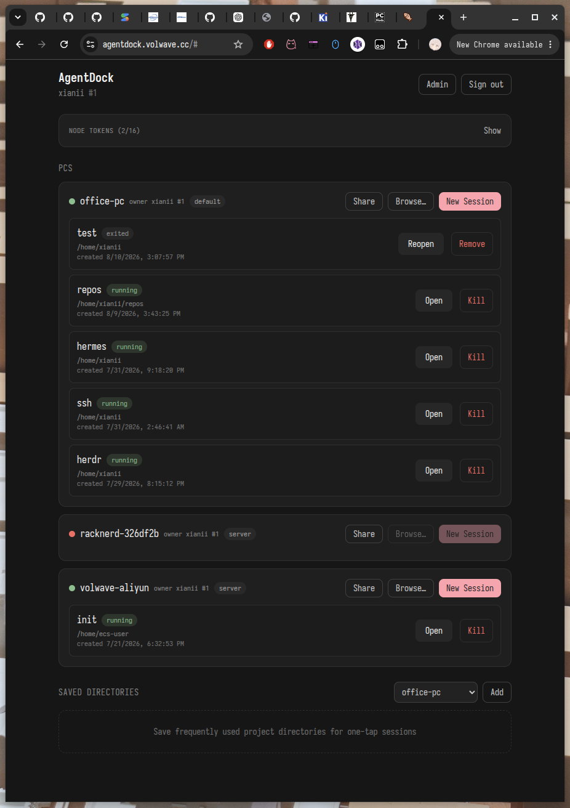
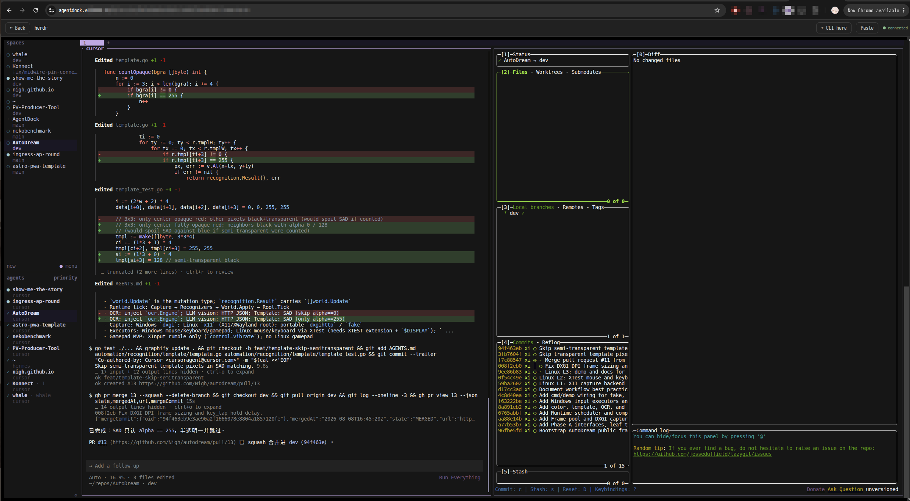

# AgentDock

Multi-user, multi-device remote control for AI coding agents.

Run Cursor CLI, Codex CLI, Claude Code or any other CLI agent on your
own PC (where your repos, environment and subscriptions live), then
attach to those terminal sessions from any browser — including your
phone — through a small public server. Sessions survive browser
disconnects, tmux-style: close your phone at night, reattach tomorrow.
Invite friends: each user connects their own PCs and can share them
with other users.

```
 phone / laptop browser                 your PC (office / home)
 ┌──────────────────┐                  ┌─────────────────────────┐
 │  Web UI (xterm)  │   wss            │  agent-client           │
 └────────┬─────────┘   ◄──────┐       │   ├─ PTY ── bash ── cursor
          │ wss               │       │   ├─ PTY ── bash ── codex
 ┌────────▼─────────┐         │  wss  │   └─ PTY ── bash ── ...
 │   agent-server   │ ◄───────┴───────┤  (dials OUT, no open port)
 │  (public, Docker)│                  └─────────────────────────┘
 └──────────────────┘
```

Key property: the PC **dials out** to the server. No port is ever
opened on your PC.



AgentDock also pairs well with
[herdr](https://github.com/herdrdev/herdr): run herdr in a session and
drive its multi-agent TUI from the browser.



herdr's dense TUI is awkward on a phone; on mobile, open a normal
terminal session instead and keep working as usual.

## Repository layout

```
internal/protocol/   shared websocket message envelope
server/
  cmd/agent-server/  public server binary
  internal/
    api/             HTTP routes (auth, sessions, directories, ws)
    auth/            bcrypt + JWT cookie sessions
    database/        SQLite (users, directories, session metadata)
    hub/             node registry + browser<->node relay
    webui/           embedded built frontend
  e2e/               end-to-end test (server + client + fake browser)
client/
  cmd/agent-client/  PC node binary
  internal/
    session/         tmux-like PTY sessions + scrollback ring buffer
    ws/              outbound websocket with auto-reconnect
web/                 Svelte 5 + Vite + Tailwind + xterm.js frontend
screenshots/         README images (dashboard, herdr)
```

## Quick start

### 1. Server (public machine)

```bash
git clone <this repo> && cd agentdock
cp .env.example .env   # defaults are fine behind an HTTPS proxy
docker compose up -d
```

To update later:

```bash
git pull && docker compose up -d --build
```

The host port (and bind address) comes from `AGENTDOCK_PUBLISH` in
`.env` — the default `127.0.0.1:8080` keeps the container reachable
only through your reverse proxy.

No credentials to configure: open the web UI and **register — the
first account becomes the admin**. Anyone registering after that is
`pending` until the admin approves them on the Admin page.

Put it behind an HTTPS reverse proxy (Caddy, nginx, Traefik) —
websockets must be proxied too. Example Caddy:

```
example.com {
    reverse_proxy localhost:8080
}
```

For plain-http testing only, set `AGENTDOCK_COOKIE_SECURE=false`.

<details>
<summary>Deploying to a host without a registry (docker save/load)</summary>

If the server host can't pull from a registry, build locally and ship
the image over SSH:

```bash
docker build -t agentdock:latest .
docker save agentdock:latest | gzip | ssh myserver 'gunzip | docker load'
ssh myserver 'mkdir -p ~/app/agentdock'
scp docker-compose.yml .env myserver:~/app/agentdock/
ssh myserver 'cd ~/app/agentdock && docker compose up -d'
```

Change `build: .` to `image: agentdock:latest` in the remote
`docker-compose.yml`; the default `AGENTDOCK_PUBLISH=127.0.0.1:8080`
already keeps the port loopback-only for your reverse proxy.

</details>

Verify the deployment end to end:

```bash
curl -s https://example.com/api/state          # 401 = auth is on
```

### 2. Client (your PC)

Sign in to the web UI and use the **Node Tokens** card on the
dashboard to create a node token (`adk_...`), optionally with an
alias like `work-laptop`. The token is shown once; the server only
stores a hash. A client connecting with it automatically belongs to
your account. You can hold up to 16 tokens — create one per PC so
deleting a token (which kicks and locks out its PCs) never affects
the others.

On Linux, one script installs *and* upgrades (needs Go; run it again
any time to update):

```bash
./scripts/install-client.sh
```

First run it asks for the server URL, token and node name and stores
them in `~/.config/agentdock/client.env` (mode 0600); then — and on
every later run — it does `git pull`, rebuilds, installs the binary to
`~/.local/bin` and (re)starts a systemd user service (with
`loginctl enable-linger` so it survives logouts). Watch logs with
`journalctl --user -u agent-client -f`.

Manual alternative (macOS, or if you prefer your own service manager) —
build the binary and connect; it reconnects automatically with backoff,
and sessions survive network blips:

```bash
make client        # -> bin/agent-client (or: make client-all to cross compile)
bin/agent-client connect \
  --server https://example.com \
  --token adk_XXXXXXXX... \
  --name office-pc
```

Don't run the client in Docker: sessions would see the container's
filesystem and environment instead of your real repos, shells and
agent-CLI credentials, which defeats the purpose. The binary is
static and dependency-free; systemd is all it needs.

### 3. Browser

Open `https://example.com`, sign in, and:

1. See `office-pc` online on the dashboard.
2. Click **New Session** on its card, **Browse…** to pick a directory
   graphically, or tap a saved directory for a one-tap session.
3. In the terminal: `cd ~/project && cursor` (or `codex`, `claude`, ...).
4. Close the browser whenever. The session keeps running on your PC.
5. Reopen later — the terminal is restored with its recent scrollback.

## Users, PCs and sharing

- The first registered account is the **admin**; later registrations
  need approval on the Admin page before they can sign in.
- A PC (node) belongs to the user whose token it connects with, and is
  visible to its owner and to admins.
- Every user's uid is shown next to their name (`alice #1`). Anyone
  who can access a node can **share** it with another user by uid from
  the node card — access is all-or-nothing (see, open and kill every
  session on that node, and share it onward). Only the node's owner or
  an admin can revoke a share.
- Admins can also grant any node to any user from the Admin page.

## Configuration (server)

| Variable | Required | Default | Purpose |
|---|---|---|---|
| `AGENTDOCK_ADDR` | no | `:8080` | Listen address |
| `AGENTDOCK_DB` | no | `./data/agentdock.db` (`/data/agentdock.db` in Docker) | SQLite path |
| `AGENTDOCK_JWT_SECRET` | no | auto-generated, persisted in SQLite | JWT signing key |
| `AGENTDOCK_COOKIE_SECURE` | no | `true` | Set `false` only for plain-http testing |
| `AGENTDOCK_PUBLISH` | no | `8080` (`.env.example` sets `127.0.0.1:8080`) | Docker-compose only: host port or `ip:port` to publish |

Client flags (env fallbacks in parentheses): `--server`
(`AGENTDOCK_SERVER`), `--token` (`AGENTDOCK_NODE_TOKEN`), `--name`
(`AGENTDOCK_NODE_NAME`, hostname by default).

## Security model

- Passwords are bcrypt-hashed; no default or env-injected credentials
  exist — the first web registration creates the admin.
- New accounts are inactive until an admin approves them; approval is
  re-checked on every request, so revocations apply immediately.
- Browser sessions use a signed JWT in an `HttpOnly` `SameSite=Lax`
  cookie (7-day expiry); the terminal websocket is authenticated by the
  same cookie plus an Origin check, and every session/browse/terminal
  request re-checks node access.
- Each PC node authenticates with one of its owner's bearer tokens
  (`adk_...`, shown once, stored as a SHA-256 hash, max 16 per user,
  individually revocable — deleting a token disconnects its PCs);
  wrong tokens get a 401 before any upgrade.
- State-changing requests pass a same-origin check (CSRF guard).
- The PC never listens; it only dials out over `wss`.

## Development

```bash
make test                      # go vet + all tests (incl. e2e PTY round-trip)
make dev-server                # server on :8080; register the admin in the browser
cd web && npm run dev          # Vite dev server on :5173, proxies /api
go run ./client/cmd/agent-client connect \
  --server http://localhost:8080 --token <token from the dashboard>
```

`make all` builds everything into `bin/` with the frontend embedded in
`agent-server`.

## Design notes & future-proofing

- **Sessions live in the `agent-client` process.** Like a tmux server,
  if the client (or the PC) restarts, sessions end; the dashboard then
  shows them as `exited`. Scrollback replay is a 256 KB in-memory ring
  per session.
- One flat JSON message envelope (`internal/protocol`) multiplexes all
  of a node's sessions over its single websocket; the hub routes each
  session to the right node.
- Node access is deliberately all-or-nothing per node; per-session
  permissions and agent-type metadata remain extension points.
